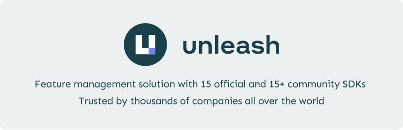

<a href="https://getunleash.io" title="Unleash - Empowering developers to release with confidence">
    
</a>

# Unleash Documentation
## What is Unleash?

Unleash is a powerful open-source solution for feature management. It streamlines your development workflow, accelerates software delivery, and empowers teams to control how and when they roll out new features to end users. With Unleash, you can deploy code to production in smaller, more manageable releases at your own pace.

Feature flags in Unleash let you test your code with real production data, reducing the risk of negatively impacting your users' experience. It also enables your team to work on multiple features simultaneously without the need for separate feature branches.

Unleash is the most popular open-source solution for feature flagging on GitHub. It supports 15 official client and server SDKs and over 15 community SDKs. You can even create your own SDK if you wish. Unleash is compatible with any language and framework.

**[Try Unleash Enterprise for free](https://www.getunleash.io/plans/enterprise-payg)**

## About this repository

This repository contains the source code for the official [Unleash documentation](https://docs.getunleash.io). The site is built entirely by the [Fern CLI](https://buildwithfern.com/).

API specs are committed to the repo and kept up to date by CI — you don't need to fetch them locally.

## Quickstart

### Prerequisites
- [Node.js](https://nodejs.org/) 20+ (required to install and run the Fern CLI)
- [Fern CLI](https://buildwithfern.com/learn/cli-api/cli-reference/global-options): `npm install -g fern-api`

### Clone and run

```bash
git clone https://github.com/Unleash/unleash-documentation.git
cd unleash-documentation
fern docs dev
```

That's it. The dev server starts at `http://localhost:3000`.

## Command reference

| Command | What it does |
| --- | --- |
| `fern docs dev` | Starts the local dev server. |
| `fern check --strict-broken-links` | Validates the documentation and checks for broken links. |
| `node scripts/fetch-openapi.mjs` | Manually refreshes the API specs from the hosted Unleash instance. Only needed if you want a newer spec than what's committed. |

## How API specs are updated

CI automatically fetches the latest OpenAPI spec from the hosted Unleash instance on every push to `main` and every PR. The spec is split into three domains to keep the API reference navigable:

- **Admin API** (`fern/apis/admin-api/`): All endpoints except Client and Frontend.
- **Client API** (`fern/apis/client-api/`): Client-tagged endpoints only.
- **Frontend API** (`fern/apis/frontend-api/`): Frontend API-tagged endpoints only.

You only need to run `node scripts/fetch-openapi.mjs` locally if you're working on API reference content and need a spec that's newer than the last CI run.

## How last-updated dates work

A GitHub Action (`.github/workflows/update-last-updated.yml`) runs on every pull request and automatically adds or updates a `last-updated` field in the YAML frontmatter of any changed MDX file. You don't need to set this manually.

## Architecture

- **Engine**: [Fern](https://buildwithfern.com/)
- **API specs**: OpenAPI JSON files in `fern/apis/`, fetched by CI from a hosted Unleash instance
- **Custom footer**: React component (`fern/components/CustomFooter.tsx`), server-side rendered by Fern
- **Custom styling**: CSS overrides in `fern/styles.css`. For detailed architecture notes and conventions, see [CLAUDE.md](./CLAUDE.md).

## Contributing

We welcome contributions. If you find something that's wrong, unclear, or missing, feel free to open an issue or submit a pull request.

1. Fork and clone this repository.
2. Create a new branch for your changes.
3. Run `fern docs dev` to preview locally.
4. Submit a pull request.

For contributions to the Unleash product itself, see the main [Unleash repository](https://github.com/Unleash/unleash).

## Migration history

This documentation was migrated to its own repository on 2 February 2026. It previously lived in the `website` folder of the main [Unleash repository](https://github.com/Unleash/unleash).

You can find the commit history prior to the migration date in the [`Unleash/unleash`](https://github.com/Unleash/unleash) repository.
